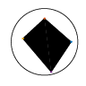

# tumbling-polygon

This is a GNU Octave port of [my answer (237847)][mse-a] to
["Simplifying code that displays a square rolling inside a circle"][mse-q]
on Mathematica Stack Exchange.

The actual computation of the trajectory using `tumbling_trajectory`
is very quick, since we are merely solving a first-order ODE.
It is only the generation of the GIF which is slow.
Here we use [carandraug's method][so-gif]:
first print the frames to a PDF,
then read the pages and write to a GIF.

````octave
demo animate_tumbling
````



Licensed under "MIT No Attribution" (MIT-0), see [LICENSE].

[mse-a]: https://mathematica.stackexchange.com/a/237847
[mse-q]: https://mathematica.stackexchange.com/q/237692
[so-gif]: https://stackoverflow.com/a/29495882

[LICENSE]: LICENSE
